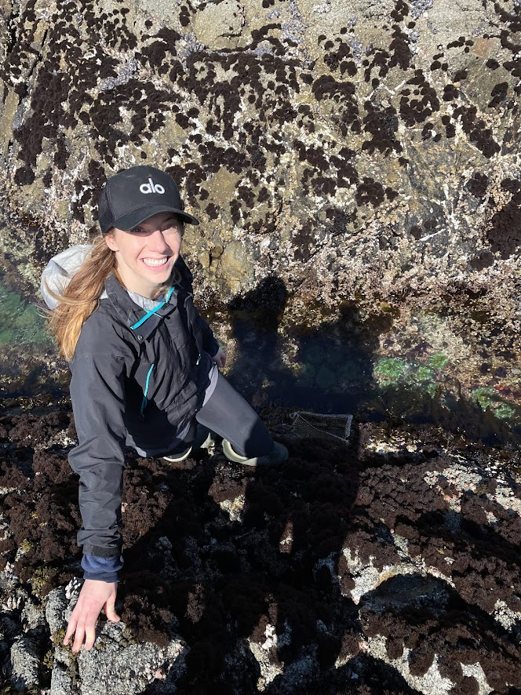

Linked with both my research and teaching experiences, I'm committed to furthering diversity, equity and inclusion within academia. I helped co-create and run the [Stanford Biology PhD Preview Program](https://biology.stanford.edu/academics/phd-program/stanford-biology-phd-preview-program), which helps prospective students nagivate the application process and leverage their strengths within their applications. I also worked on the [DIMES Network](https://www.nsf.gov/awardsearch/showAward?AWD_ID=2018116) (Diversifying and Integrating Marine Education at Stations) where we created an ecology field curriculum for undergraduate students along with existing virutal field trips to increase access to coastal field stations.  
   

In addition, I have written about my research for various blog posts ([HMS High Tidings](https://hightidings.stanford.edu/2020/06/25/sharky-reefs/), [ICRS Reefbites Feature Friday](https://reefbites.wordpress.com/2020/02/03/feature-friday-jamie-mcdevitt-irwin/)) and have interacted with the public on World Ocean's Day as a scientific diver and at the Hopkins Marine Station running the surfgrass touch tank.  
   

{width=50%}  

Showing students from the Middlebury Institute of International Studies my field experiment in Big Sur, California; Photo Credit: Meghan McKenna  