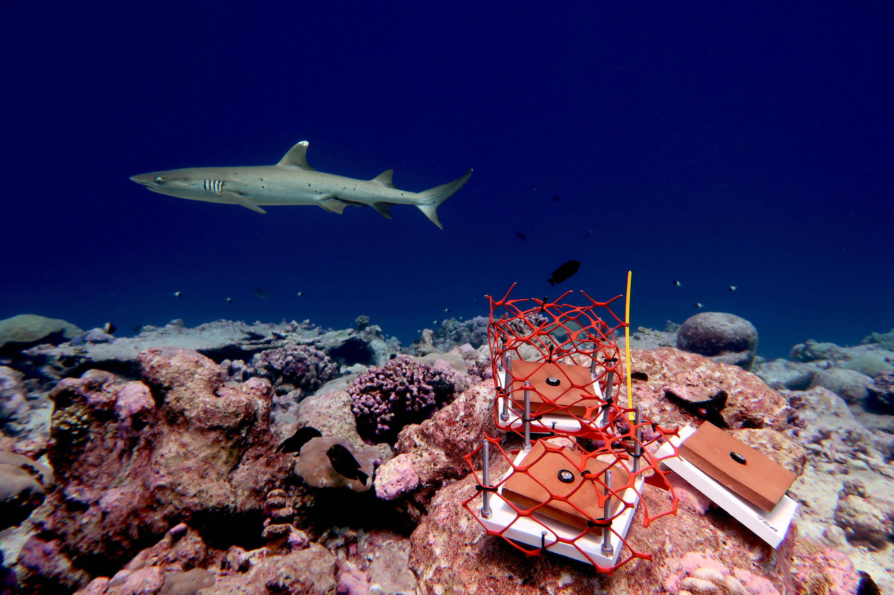

### Trophic interactions shaping communities and ecosystems               
Large-bodied consumers are increasingly lost from ecosystems due to hunting and fishing pressure from
humans. As these consumers are critical drivers of community structure and ecosystem function, its crucial
to evaluate the cascading effects of their disappearance.

Fishes play integral roles in structuring coral reefs by limiting algae that compete with corals; however, reefs are rapidly losing large fishes due to fishing pressure. Using an experiment at Palmyra Atoll, we found that the loss of fishes on coral reefs can increase the variability and decrease the predictability of coral reef benthic communities (McDevitt-Irwin et al. 2023, Oecologia). Reefs are also facing dramatic declines in their shark populations, but there is very little research on how the loss of sharks may cascade through the food web to reef recovery. We found that the remote and protected Chagos Archipelago exhibited compensatory dynamics within the fish and benthic community that maintained key processes across a gradient of shark abundance and when fish are excluded (McDevitt-Irwin et al. 2024, Biological Conservation). 

Most community ecology research captures a static snapshot of a dynamic process, largely ignoring how species interactions vary across time. In Palmyra Atoll, we demonstrated that fish promote initial coral recruitment after a disturbance, but their effects diminish after three years (McDevitt-Irwin et al. 2023, Sci Rep). In the rocky intertidal in California, we found that the timing of when herbivores arrived after a disturbance influences short-term but not long-term algae community composition, demonstrating this strong and deterministic top-down control in this ecosystem (McDevitt-Irwin et al. In Prep).   

I am currently co-leading a [NSF LTER Working Group](https://lternet.edu/working-groups/caged/) exploring how the loss of consumers across marine, terrestrial and freshwater ecosystems affects community variability across space (i.e., dissimilarity in community composition).  

{width=70%}  
Experiment in the Chagos Archipelago, Photo Credit: Kristina Tietjen  

  
   

### Causes and consequences of biodiversity change
As we are currently facing the sixth mass extinction event, its imperative to understand the drivers of
biodiversity over space and time and the ecosystem-wide consequences of biodiversity change across
multiple levels of biological organization. 

Most research on biodiversity change monitors one taxonomic group, so my recent work has expanded on this, studying changes in biodiversity across multiple taxonomic groups. Using regional scale data of coral reef benthic communities in the Bahamas, we found that beta diversity patterns, but not alpha diversity, are non-independent among taxonomic groups, demonstrating that changes in the composition of one taxonomic group can have cascading effects on overall composition (McDevitt-Irwin et al. 2021, Oecologia). 

My current work evaluates how anthropogenic stressors impact coral reef biodiversity across multiple taxonomic groups (i.e., fishes, corals, algae, microbes) in Moorea, French Polynesia. I am evaluating how fishing pressure and nutrient pollution influence coral reef diversity using a four-year long field experiment. To complement this experimental work, I am integrating observational data using new technologies (i.e, eDNA, bioacoustics, computer vision) to determine how landscape scale biodiversity is driven by fishing pressure, nutrient pollution, and heat waves. 

In addition, I am currently part of a working group evaluating how macroalgae diversity and stability are related over space and time in Moorea, French Polynesia.  

{width=70%}  
Fieldwork in Moorea, French Polynesia  

  
   

### Ecosystem resilience to climate change
As ecosystems worldwide are facing extraordinary climate change, it’s incredibly important to
understand what makes an ecosystem resilient to these environmental stressors.

Coral reefs are an especially at-risk ecosystem under climate change, with widespread bleaching events that can cause shifts from coral to algae dominated reefs. However, beyond reducing carbon emissions, it remains unclear how to protect coral reefs from heat stress. At Kiritimati, Kiribati, we demonstrated that sites with low local disturbance, which originally had the highest coral cover, had the greatest coral cover loss. However, individual coral colonies had greater survival at low human disturbance, demonstrating local stressors can impair coral survival under heat stress (Baum et al. 2023, Sci Adv).

Climate change alterations do not only occur at the level of organisms visible to the naked eye; human activities also cause dramatic changes in the unseen worlds of microbes. I showed that local and global stressors typically increase diversity in the coral microbiome, but few studies have considered multiple stressors in a field setting (McDevitt-Irwin et al. 2017, FMARS). I then addressed this knowledge gap by monitoring individual coral colonies across a gradient of human disturbance before and during an El Niño event at Kiritimati. We found that both stressors can interact to increase coral microbiome diversity and destabilize the coral microbiome (McDevitt-Irwin et al. 2019, Coral Reefs).

I am currently collaborating on a project evaluating spatio-temporal patterns of coral mortality and bleaching across gradients of nutrient pollution in Moorea, French Polynesia.  
    

{width=50%}   
JMI sampling a coral colony, Photo Credit: Kristina Tietjen  

  
   

