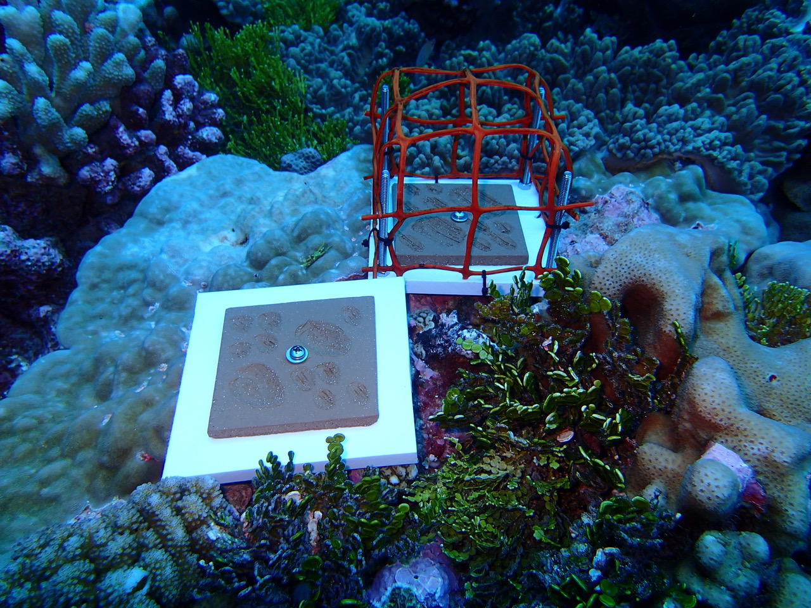

Ecosystems around the world are experiencing escalating threats including both the loss of consumers and changing disturbance patterns. These changes often act jointly to affect ecosystems: after disturbances, ecosystems undergo succession and consumers can play an integral role in structuring these developing communities.  
   

**For my PhD research, I'm interested in how consumers affect communities as they assemble and recover from disturbances**. I'm asking the questions:  

*How do large fishes influence coral reef benthic succession and coral recruitment?*
{width=100%}  
Experiment in the Chagos Archipelago, Photo Credit: Kristina Tietjen  
   

*How do large fishes influence community variability across space and turnover through time during coral reef succession? How do large fishes influence coral recruitment through grazing and grazing scars?* 
{width=100%}  
Experiment in Palmyra Atoll, Photo Credit: Joe Wible  
   

*How does herbivore arrival timing influence rocky intertidal succession?*
{width=100%}  
Experiment in Big Sur, California  

   

Previously, I conducted a variety of research ranging from conservation policies of marine fishes in Canada (McDevitt-Irwin et al. 2015), nursery role of seagrass ecosystems (McDevitt-Irwin et al. 2016), to coral microbiome community ecology (McDevitt-Irwin et al. 2017, McDevitt-Irwin et al. 2019).

