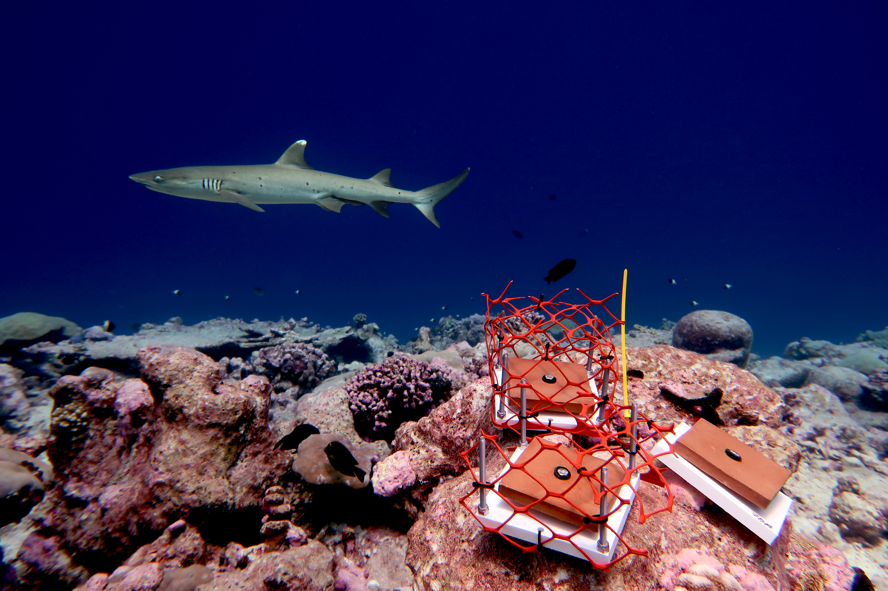

### Top down control of coral reef succession    
I'm currently assessing how large fishes affect coral reef benthic succession and coral recruitment through field experiments in both the Chagos Archipelago and Palmyra Atoll. I'm asking the questions 1) is there evidence for top down control from sharks through benthic feeding fishes down to the developing benthic community? 2) how do large fishes affect community variability across space and turnover through time during coral reef benthic succession? and 3) how do large fishes influence coral recruitment directly through grazing and indirectly through grazing scars?

{width=70%}   
Experiment in the Chagos Archipelago, Photo Credit: Kristina Tietjen  

  
   

### Timing of arrival during community assembly
I'm also interested in moving beyond the presence or absence of an herbivore, and considering herbivores as transient members of the community with variable arrival timing due to factors like mobility and patch isolation. Using a field experiment in the rocky intertidal in Big Sur, California, I'm asking the question: how does herbivore arrival timing influence rocky intertidal algal succession?  

  
{width=70%}  
Experiment in Big Sur, California  

 
   

### Coral reef diversity patterns     
I've previously worked on understanding how and why species composition patterns change across space and time, for both micro and macro organisms. By tracking the microbiome of coral colonies at Kiritimati Island, we asked the question: how do local disturbance and a heat stress event impact coral microbiome diversity? (McDevitt-Irwin et al. 2019). In addition, using field observations of benthic cover from the Bahamian Archipelago, we asked the question: is there congruence in the diversity patterns of coral reef benthic taxa? (McDevitt-Irwin et al. 2021)    

{width=50%}  
JMI collecting a coral tissue sample, Photo Credit: Kristina Tietjen   

  
   

