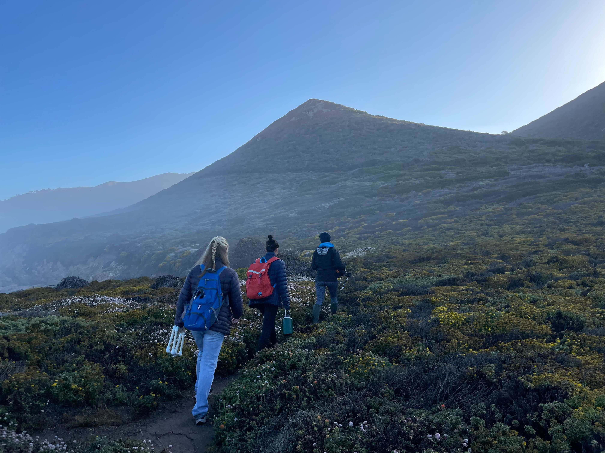

I am committed to learning and growing as an instructor and have taken various courses on course development and how to be an inclusive and effective teacher to diverse students (e.g. [Inclusive and Effective Teaching](https://vpge.stanford.edu/resources/sgsi-2022-inclusive-and-effective-teaching), [Science and Engineering Course Design](https://explorecourses.stanford.edu/search?view=catalog&filter-coursestatus-Active=on&q=CTL%20312:%20Science%20and%20Engineering%20Course%20Design&academicYear=20202021)). In addition, I shadowed a professor at West Valley Community College through the [Preparing Future Professors](https://vpge.stanford.edu/events/programs/preparing-future-professors) program. 

{width=70%}     
Fieldwork with my interns at Big Sur, California; Photo Credit: Sarah Pierce  

 

### Teaching Assistant
* Ecology, Stanford University (2020)  
* Research in Ecology and Evolution, Stanford University (2018)   
* Marine Population Ecology and Dynamics, Bamfield Marine Sciences Centre (2016)  
* Evolution and Biodiversity, University of Victoria (2016)  
* General Biology II, University of Victoria (2015)  

### Mentoring  
* Mica Chapuis (Stanford Research Assistant, 2022-2023)  
* Ann Gobei-Bacalyn (CSUMB REU Internship, 2022)  
* Gwendolyn Donehue (Stanford Reefs Internship, 2022)  
* Mica Chapuis (Stanford Undergraduate Honours Thesis, 2022)  
* Sophia Haase Cox (Stanford BSURP Internship, 2021)  
* Mica Chapuis (Stanford BSURP Internship, 2020)  
* Alexandra Brainerd (Stanford HMS Internship, 2019)  
* Mathangi Janakiraman (MITACS Research Assistant, 2016)  
* Hayley Davies (UVic Volunteer, 2015-2016)    
* Lisa Szostek (UVic Directed Studies, 2015)  

### R Workshops  
* Created and taught a coding workflow (RMarkdown and GitHub) workshop for Grade 10 students at Santa Catalina High School (November 2018)
* Created and taught a ggplot2 workshop at the Stanford University Surf N Turf Conference  (October 2018):   

