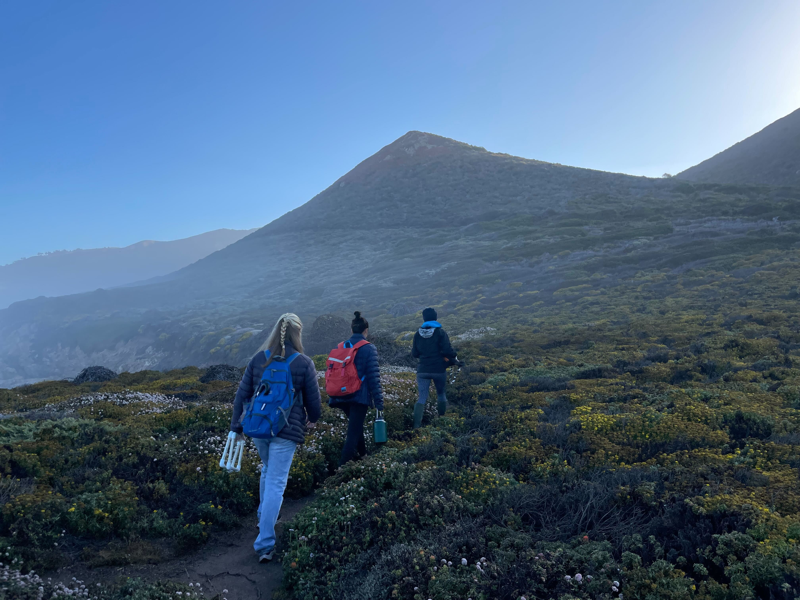

I have worked as a teaching assistant at the University of Victoria, the Bamfield Marine Sciences Centre, and Stanford University. Some of my best experiences have been mentoring undergraduate students, through programs like [CSUMB REU Program](https://csumb.edu/reu/), [MITACS](https://www.mitacs.ca/en/programs/globalink/globalink-research-internship), Stanford BSURP, or mentoring honors thesis students at Stanford. In addition, I have created and taught coding workflows in RMarkdown and GitHub for both local high school students and other graduate students. 

I am committed to learning and growing as an instructor and have taken various courses on course development and how to be an inclusive and effective teacher to diverse students (e.g. [Inclusive and Effective Teaching](https://vpge.stanford.edu/interdisciplinary-learning/sgsi/2020), [Science and Engineering Course Design](https://vpge.stanford.edu/courses/2022-2023-engr-312)). In addition I shadowed a professor at West Valley Community College through the [Preparing Future Professors](https://vpge.stanford.edu/events/programs/preparing-future-professors) program. 

   
Fieldwork with my interns at Big Sur, California; Photo Credit: Sarah Pierce